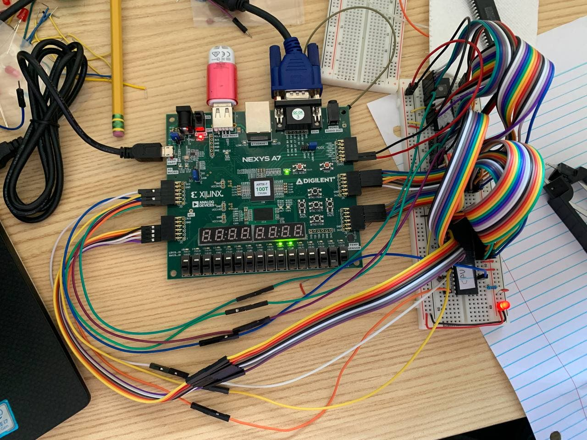

<!-- README.md -->

# 6502 Arcade Machine

Repository: <https://github.com/ucsbieee/arcade>

Website: <https://arcade.ucsbieee.org/>

## Description

UCSB IEEE is working on a large project where we build an arcade machine based on a 6502 microprocessor. I.E. <ins>no microcontrollers!</ins> Only the 6502 microprocessor, ROM and RAM ICs, and FPGA(s).

### Motivation

The UCSB ECE curriculum gives lots of opportunities to practice using microcontrollers (ECE 5, ECE 153ab, ECE 189abc). However, there are no classes that give practice in building systems from a microprocessor. Therefore, this club project is meant to fill that gap in experience.

Also, having an arcade machine in the lab would look awesome. ;)

## Current State

The hardware prototype has been finished on breadboards. It works with both the [Nexys A7-100T](https://digilent.com/reference/programmable-logic/nexys-a7/start) and [Cmod A7-35T](https://digilent.com/reference/programmable-logic/cmod-a7/start) [Artix-7](https://www.xilinx.com/products/silicon-devices/fpga/artix-7.html) development boards. All peripherals (GPU, ROM, RAM, VGA port, controller ports) work. Our next step is writing the software.

For the software, we are currently trying to configure a custom [cc65](https://cc65.github.io/) linker so that we can simply write the games in C instead of 6502 assembly. Check back for updates!

## How to Contribute

Just follow [this guide](https://arcade.ucsbieee.org/guides/github/). Anyone can help out by doing an item off the [issue list](https://github.com/ucsbieee/arcade/issues). Each item has a difficulty and skill-set description, so anyone from any skill level can find some item they can complete.

There will be weekly meetings/lectures for anyone who wants to help/learn more.

## Contact

Discord Server: <http://discord.ucsbieee.org/>

### Project Managers

<!-- README/tables/project-managers.tgn -->
|       Name      |     Role      |                             Discord                             |          Email          |
|:---------------:|:-------------:|:---------------------------------------------------------------:|:-----------------------:|
| Ethan Sifferman | Project Lead  | [@E4tHam#8319](https://discordapp.com/users/120303964448096258) | esifferman@ucsbieee.org |

Let Ethan know if you want to be in a leadership role on this project!

---

## Overview

<!-- README/tables/areas.tgn -->
There are three different levels of software that need to be written: high level, assembly level, and hardware level.

|                Area               |              Relevant Skills              | Description                                                               |
|:---------------------------------:|:-----------------------------------------:|---------------------------------------------------------------------------|
|     [High Level](#high-level)     |            cs8,16 JavaScript           | We will design the games in JavaScript as a reference.                    |
| [Assembly Level](#assembly-level) | cs64,154 ece154a 6502&nbsp;Assembly | We will write the firmware in assembly and convert the games to assembly. |
| [Hardware Level](#hardware-level) |      cs154 ece152a,154a Verilog     | The GPU and address bus needs to be designed in Verilog.                  |

---

## Assembly Level

### Assembly Guides/References Used

* [65c02 Instruction Reference](http://www.obelisk.me.uk/65C02/reference.html)
* [Stephen Edwards 6502 Instruction Overview Video](https://youtu.be/WEliEAc3ZyA)
* [Ben Eater 6502 Computer Video Series](https://www.youtube.com/watch?v=LnzuMJLZRdU&list=PLowKtXNTBypFbtuVMUVXNR0z1mu7dp7eH)

### Assembly Tools/Libraries Used

* [Daryl's Kowalski 6502 Simulator](https://sbc.rictor.org/kowalski.html)
* [VASM](http://sun.hasenbraten.de/vasm) ([Barthelmann's Page](http://www.compilers.de/vasm.html)) ([-dotdir Fix](https://www.reddit.com/r/beneater/comments/gcmonc/new_vasm_v18hneed_win32_binary/))
* [py65](https://github.com/mnaberez/py65)

---

## Hardware Level

### Datasheets

* [W65C02S Microprocessor](https://westerndesigncenter.com/wdc/documentation/w65c02s.pdf)
* [AT28C256 32kB EEPROM](http://ww1.microchip.com/downloads/en/DeviceDoc/doc0006.pdf)
* [AS6C62256 32kB SRAM](https://www.alliancememory.com/wp-content/uploads/pdf/AS6C62256.pdf)
* [Cmod A7](https://digilent.com/reference/programmable-logic/cmod-a7/reference-manual)
* [Nexys A7](https://digilent.com/reference/programmable-logic/nexys-a7/reference-manual)
* [Dell 1908FP Monitor](https://downloads.dell.com/manuals/all-products/esuprt_electronics/esuprt_display/dell-1908fp_user%27s%20guide_en-us.pdf)
* [VESA, 640 x 480 @ 60 Hz Video Timing](http://www.tinyvga.com/vga-timing/640x480@60Hz)

### Hardware Guides/References Used

* [VGA Documentation](http://www.tinyvga.com/)
* [Ben Eater VGA](https://youtu.be/uqY3FMuMuRo)

### Hardware Libraries/Tools Used

* [FuseSoC](https://github.com/olofk/fusesoc)
* [Icarus Verilog](http://iverilog.icarus.com/)
* [Vivado ML Enterprise](https://www.xilinx.com/products/design-tools/vivado.html)
* [Nexys A7-100T](https://store.digilentinc.com/nexys-a7-fpga-trainer-board-recommended-for-ece-curriculum/)

---

## Miscellaneous

### Other Guides/References Used

* [NES PPU Explanation](https://www.youtube.com/watch?v=-THeUXqR3zY&list=PLrOv9FMX8xJHqMvSGB_9G9nZZ_4IgteYf&index=5)
