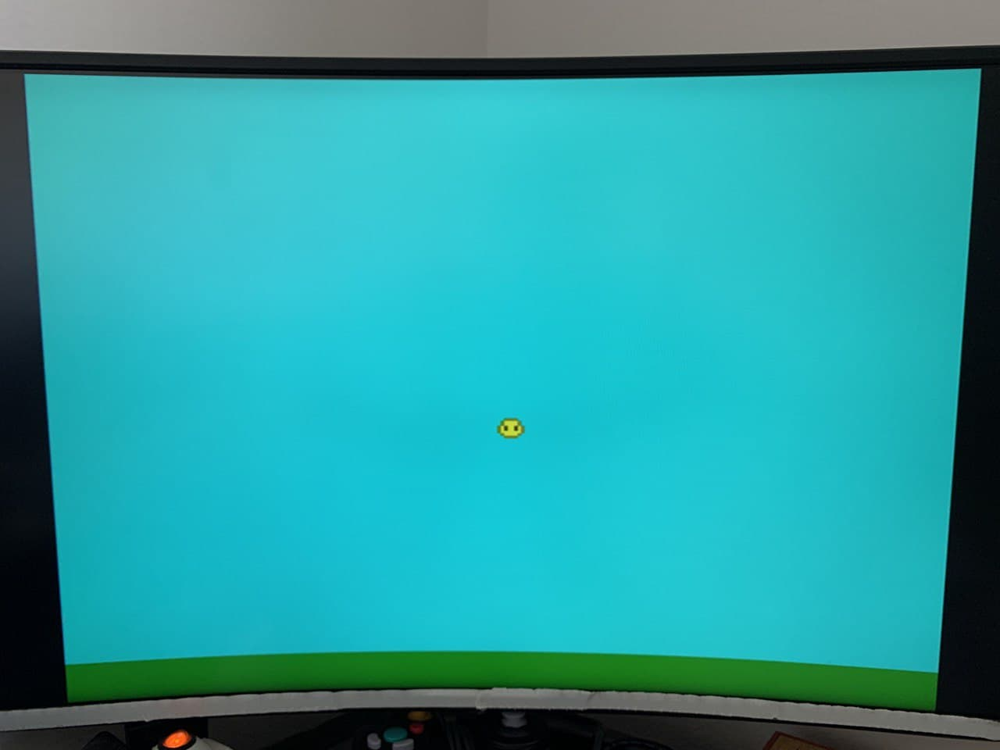
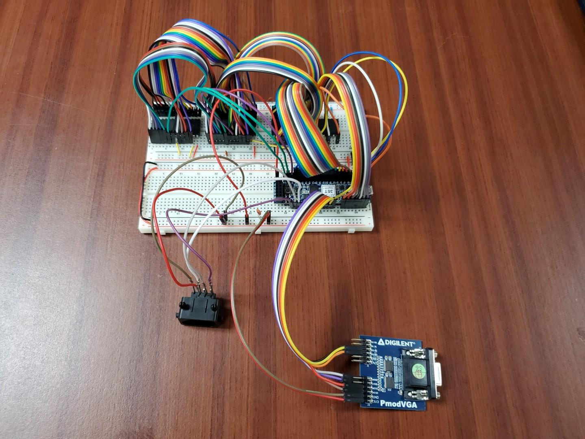

# Mapache 64

* Repository: [github.com/ucsbieee/mapache64](https://github.com/ucsbieee/mapache64)
* Website: [mapache64.ucsbieee.org](https://mapache64.ucsbieee.org)
* Discord Server: [discord.ucsbieee.org](http://discord.ucsbieee.org)

## Description

Mapache 64 is is a custom video game console based around the 6502 microprocessor. This console uses a custom graphics processing unit (GPU) written in SystemVerilog and runs on a [Cmod A7-35T](https://digilent.com/reference/programmable-logic/cmod-a7/). The firmware and games are programmed using C, and can be compiled with a custom linker script and [`cc65`](https://cc65.github.io), an open-source C to 6502 assembly compiler. This project was developed by [UC Santa Barbara's IEEE chapter](https://ucsbieee.org/), lead by [Ethan Sifferman](https://github.com/sifferman).

Video screen:

Breadboard circuit:

## References

### Games List

* [Asteroids](https://github.com/sifferman/m64-a2teroids) (2-player asteroids)
* [Flappy Bird](https://github.com/mfletcher2/mapache64-flappybird)
* [Snake](https://github.com/GDW1/m64-snake)
* [Pong](https://github.com/GDW1/m64-pong)
* [Tetris](https://github.com/ucsbieee/m64-tetris)
* [Frogger](https://github.com/ucsbieee/m64-frogger)

### Guides

* [Ben Eater 6502 Computer Video Series](https://www.youtube.com/watch?v=LnzuMJLZRdU&list=PLowKtXNTBypFbtuVMUVXNR0z1mu7dp7eH)
* [Ben Eater VGA](https://youtu.be/uqY3FMuMuRo)
* [NES PPU Explanation](https://www.youtube.com/watch?v=-THeUXqR3zY&list=PLrOv9FMX8xJHqMvSGB_9G9nZZ_4IgteYf&index=5)

### Datasheets

* [W65C02S](https://westerndesigncenter.com/wdc/documentation/w65c02s.pdf) Microprocessor
* [AT28C256](http://ww1.microchip.com/downloads/en/DeviceDoc/doc0006.pdf) 32kB EEPROM
* [AS6C62256](https://www.alliancememory.com/wp-content/uploads/pdf/AS6C62256.pdf) 32kB SRAM
* [Cmod A7](https://digilent.com/reference/programmable-logic/cmod-a7/reference-manual) FPGA board
* [VESA, 640x480 @ 60 Hz Video Timing](http://www.tinyvga.com/vga-timing/640x480@60Hz) guide

---

### Credits

#### RTL Development

* Ethan Sifferman ([github](https://github.com/sifferman))
* *Jon Balkind (consultant)* ([github](https://github.com/jbalkind))

#### PCB Development

* Ethan Sifferman ([github](https://github.com/sifferman))
* Matthew Tom ([github](https://github.com/Matthew-Tom))
* Kogan Sam ([github](https://github.com/02ks))
* Neil Balch ([github](https://github.com/neilbalch))
* *Daniel Van Dalsem (consultant)* ([github](https://github.com/aWZHY0yQH81uOYvH))

#### Firmware Development

* Ethan Sifferman ([github](https://github.com/sifferman))
* Neil Balch ([github](https://github.com/neilbalch))

#### Game Development

* Ethan Sifferman ([github](https://github.com/sifferman))
* Max Fletcher ([github](https://github.com/mfletcher2))
* Guy Wilks ([github](https://github.com/GDW1))

#### Website Development

* Ethan Sifferman ([github](https://github.com/sifferman))
* Neil Balch ([github](https://github.com/neilbalch))
* Max Fletcher ([github](https://github.com/mfletcher2))
* Xingbu Qin ([github](https://github.com/watercannons))
* Nicolas Guglielmin ([github](https://github.com/nicg6645))

---

## Name Explanation

* Mapache is the unofficial mascot of UC Santa Barbara ([source](https://www.change.org/p/the-mascot-we-deserve-change-the-ucsb-mascot-to-a-mapache))
* Mapache 64 has 64kiB of address space
